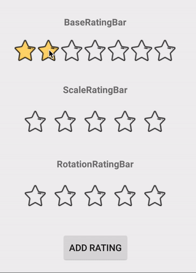
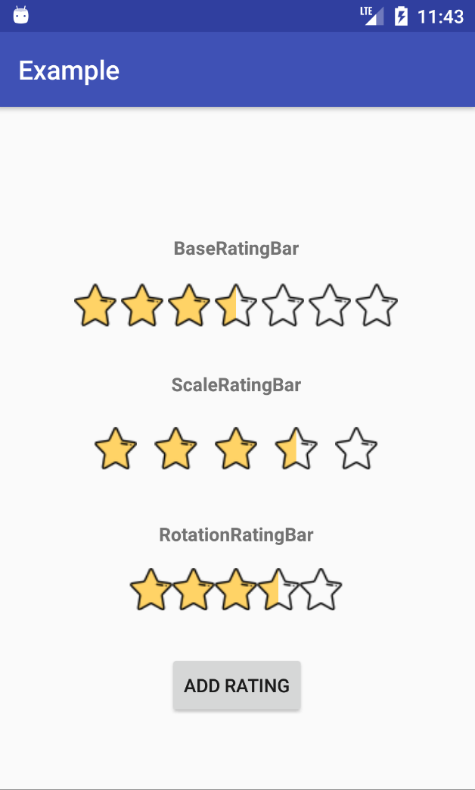

# SimpleRatingBar
[](https://jitpack.io/#ome450901/SimpleRatingBar)

>This is a very simple RatingBar library, which you can just simply extend BaseRatingBar to implement your own animation RatingBar in a few steps!

Current we already have three RatingBars :
- BaseRatingBar  
    A RatingBar without any animation.
- ScaleRatingBar  
    A RatingBar with progressive and scale animation.
- RotationRatingBar (contributed by [nappannda](https://github.com/nappannda))  
    A RatingBar with progressive and rotate animation.

## Demo
  
  
Icon made by [Freepik](http://www.freepik.com/) from www.flaticon.com 

## What's New (v1.3.6)
- Fix Star disappear bug when setting starHeight, starWidth and starPadding.
- Rename the attributes for more easily know all this library's attributes.  
    (`app:rating="2"` change to `app:srb_rating="2"`)
- Implement IsIndicator, Scrollable and Clickable settings.
- Fix Handler null pointer bug.
- Fix AnimationRatingBar out of sync bug.

## Feature
- Allow half star through click event. (contributed by [ANPez](https://github.com/ANPez))
- Support step size setting(range from 0.1 to 1.0).
- Support float rating  
  Now you can set a float rating like 3.5, 2.3, 4.7, etc., but you only need to provide two images: `filled` and `empty`, and Library will auto processes your images to support float showing!
- Add touchable setting
- Add ClearRatingEnabled setting
- Stars width and height setting. (contributed by [zhangruize](https://github.com/zhangruize))  
- Support use touch to change rating
- Custom drawable's padding
- Custom your empty and filled drawable
- Click again to clear rating
- Rotate animation
- Scale animation

## How To Use
### Install
from JitPack:

```gradle
allprojects {
    repositories {
        ...
        maven { url 'https://jitpack.io' }
    }
}

dependencies {
    compile 'com.github.ome450901:SimpleRatingBar:1.3.6'
}
```


### In Xml
```xml
<com.willy.ratingbar.ScaleRatingBar
        xmlns:app="http://schemas.android.com/apk/res-auto"
        android:id="@+id/simpleRatingBar"
        android:layout_width="wrap_content"
        android:layout_height="wrap_content"
        app:srb_numStars="3"
        app:srb_rating="2"
        app:srb_starWidth="30dp"
        app:srb_starHeight="30dp"
        app:srb_starPadding="15dp"
        app:srb_stepSize="0.5"
        app:srb_isIndicator="false"
        app:srb_clickable="true"
        app:srb_scrollable="true"
        app:srb_clearRatingEnabled="true"
        app:srb_drawableEmpty="@drawable/start_empty"
        app:srb_drawableFilled="@drawable/star_filled">
</com.willy.ratingbar.ScaleRatingBar>
```

### In Your Code
```java
ScaleRatingBar ratingBar = new ScaleRatingBar(this);
ratingBar.setNumStars(5);
ratingBar.setRating(3);
ratingBar.setStarPadding(10);
ratingBar.setStepSize(0.5f);
ratingbar.setIsIndicator(false);
ratingbar.setClickable(true);
ratingbar.setScrollable(true);
ratingbar.setClearRatingEnabled(true);
ratingBar.setEmptyDrawableRes(R.drawable.start_empty);
ratingBar.setFilledDrawableRes(R.drawable.start_empty);
ratingBar.setOnRatingChangeListener(new BaseRatingBar.OnRatingChangeListener() {
    @Override
        public void onRatingChange(BaseRatingBar ratingBar, int rating) {
            Log.e(TAG, "onRatingChange: " + rating);
    }
});
```

## Want to Implement Your Own Animation?
#### Only 2 Steps you need to do:
- Create a class that extend `BaseRatingBar`
- Override the `emptyRatingBar` and `fillRatingBar` this two method, and then you can start implement your own animaion!

>You can follow [ScaleRatingBar](https://github.com/ome450901/SimpleRatingBar/blob/master/library/src/main/java/com/willy/ratingbar/ScaleRatingBar.java) to implement your own class.

## Todo
- Implement some other animations
- Find a better way to implement animation

## About Me
Follow me at [Medium](https://medium.com/@ome450901).

## License
```
MIT License

Copyright (c) 2017 WillyYu

Permission is hereby granted, free of charge, to any person obtaining a copy
of this software and associated documentation files (the "Software"), to deal
in the Software without restriction, including without limitation the rights
to use, copy, modify, merge, publish, distribute, sublicense, and/or sell
copies of the Software, and to permit persons to whom the Software is
furnished to do so, subject to the following conditions:

The above copyright notice and this permission notice shall be included in all
copies or substantial portions of the Software.

THE SOFTWARE IS PROVIDED "AS IS", WITHOUT WARRANTY OF ANY KIND, EXPRESS OR
IMPLIED, INCLUDING BUT NOT LIMITED TO THE WARRANTIES OF MERCHANTABILITY,
FITNESS FOR A PARTICULAR PURPOSE AND NONINFRINGEMENT. IN NO EVENT SHALL THE
AUTHORS OR COPYRIGHT HOLDERS BE LIABLE FOR ANY CLAIM, DAMAGES OR OTHER
LIABILITY, WHETHER IN AN ACTION OF CONTRACT, TORT OR OTHERWISE, ARISING FROM,
OUT OF OR IN CONNECTION WITH THE SOFTWARE OR THE USE OR OTHER DEALINGS IN THE
SOFTWARE.
```
